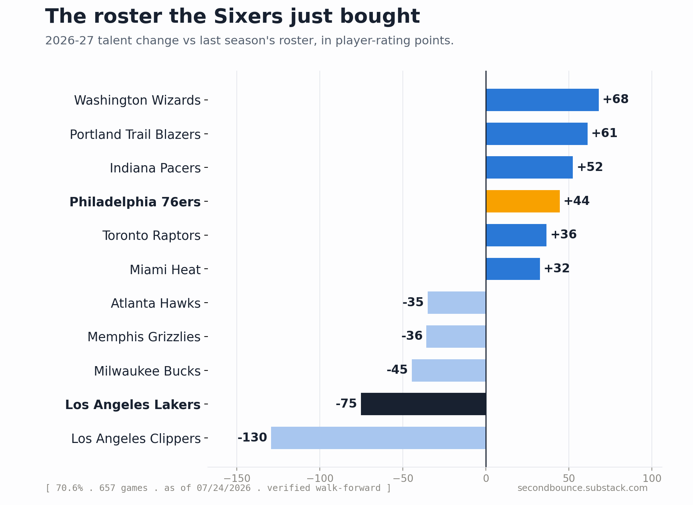

# The Last Decision

*LeBron picked Philadelphia. Our roster model moves the Sixers up 44 points, to 12th, and the names outrun the forecast.*

LeBron James made what he called his last decision, and it was Philadelphia.

A two-year deal, reportedly worth about 8 million, at age 41. He leaves the Lakers after eight seasons and joins a Sixers core of Tyrese Maxey, VJ Edgecombe, Jaylen Brown, and Joel Embiid. On paper it reads like a superteam. Our numbers read it as something quieter, and the gap between those two readings is the whole story.

Here is what the roster model does. It takes every team's rating from the end of last season, pulls it partway back toward league average (1500), because one season is a small sample and rosters turn over, and then it adds the talent a team gained or lost this summer. That talent is measured in player-rating points and kept zero-sum across the league, so nobody's gain is invented.

The Sixers gain 44 of those points. That is a real move, top four this offseason, behind only Washington, Portland, and Indiana. It lifts Philadelphia from a team that finished last year at 1486, below the league line, to a preseason 1529. In the full table that is 12th.

Twelfth is not where the marquee wants to be. But look at where they started. Philadelphia finished last season below average, and a summer of star names does not erase a season of results in our system, it sits on top of them. Add LeBron and Jaylen Brown to a middling base and you get a good team with real questions, not a coronation. The model has watched a lot of superteams. It prices the health of a 41-year-old and a center who has missed time the way an actuary would, without sentiment.

The other side of the ledger is in Los Angeles. The Lakers lose 75 points, the steepest fall of any team this summer except the Clippers, and drop to 1481, 19th. That is what losing your best forecast-mover looks like when you do not replace him.

For scale, the model still has Oklahoma City on top at 1630, then San Antonio and Boston. Philadelphia sits closer to the middle of the league than to that group. LeBron chose the team he believes gives him the best chance at a title. Our numbers say he improved a contender's odds without becoming the favorite, which is a fair description of what one 41-year-old can still do.

One honest note, because we always leave the trail. These are preseason forecast numbers from our roster model, not a game prediction, and every one of them reverts toward 1500 by design. Most good teams' ratings fall between June and October in our system. That is uncertainty, not decline. When the games start on October 21, we log a pick before tip and grade it after the final, and Philadelphia's 12th gets tested one night at a time.

The model will be watching. So will everyone else.
