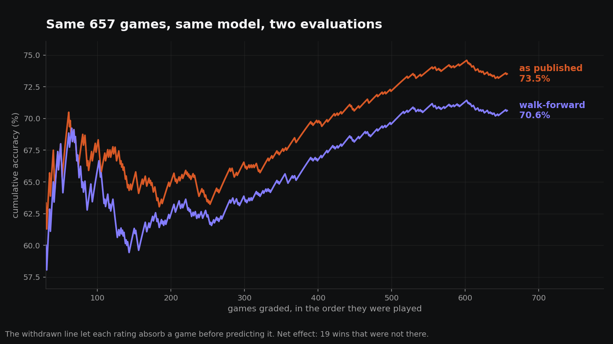

# How We Caught Our Own Model Cheating

*We published a 73.5% record, audited our own tracker, and cut it to 70.6%. Here's the bug that inflated it, and why this kind of error survives review.*

We run a model that predicts NBA games. Every pick gets published before tip-off and graded after the final whistle, and the whole log is public. That log is the product. The model is just the thing that fills it in.

In early July we sat down to write a season recap and needed one number: how often were we right? The tracker said 73.5%, across 657 games. It was a good number. Good enough that we almost led with it.

Instead we went to check it, and it fell apart.

The honest figure is **70.6%**. Same model, same 657 games, same season. The difference was entirely in how we'd been measuring.

## The bug

Our ratings work like chess Elo. Every team carries a number, every result nudges those numbers, and a prediction is a comparison of two numbers at a moment in time.

The word doing all the damage there is *moment*.

The old tracker walked back through the season, took each completed game, and asked the model who would win. Reasonable-sounding. But the ratings it asked were today's ratings, already updated with every result the season had produced. Including the game it was being asked about.

So when it asked "who wins Boston at Denver on January 14th," the rating it consulted had already absorbed the fact that Denver won that game. Not much. One game out of a thousand-odd. But in the direction of the answer, every single time, 657 times in a row.

The model wasn't guessing. It was remembering, slightly.

## Why this kind of bug survives

Nothing crashes. No error appears in a log. You get a number that is plausible, stable, reproducible, and wrong, and it is wrong in the direction you were hoping for. Every incentive you have is to accept it and move on.

It also passes the checks people actually run. The code did what it said. The arithmetic was right. The sample was real, the games were real, the outcomes were real. If you'd asked us to review that function we'd have read it and shrugged, because the flaw isn't in any line of it. It's in the order the lines run relative to time.

That's the general shape of the thing, and it isn't specific to basketball. Any time you evaluate a forecast by reconstructing it after the fact, you are trusting yourself to perfectly rebuild a past state of knowledge while sitting on top of the answers. People are bad at this. We were bad at it.

## Finding it

The fix for a question about time is to be strict about time.

We rebuilt the season as a walk-forward replay. Start with ratings that know nothing. Take the games in the order they were played. For each one: predict first, using only what a rating built from earlier games could know, then record the result, then let the ratings update, then move to the next game. Never let step three happen before step two.

Then we ran that against the same 657 games the tracker had claimed.

Early on, the two lines tangle around each other. There isn't much season for a rating to leak yet. Then they separate, somewhere around the two hundredth game, and they stay separated. That gap is the bug, drawn.

There's a detail in there worth sitting with. The leak didn't quietly lift every prediction. It flipped 48 games from wrong to right, and it also flipped 29 from right to wrong. Seventy-seven games changed their answer, and the net was 19 wins we hadn't earned. 483 correct became 464.

It wasn't a small consistent bonus. It was noise with a thumb on the scale, and it's a reminder that a leak doesn't have to be large to be disqualifying. It only has to be systematic.

## What changed, other than the number

We could have fixed the audit script and moved on. That would have left the actual problem in place, which was that our record depended on reconstructing the past correctly.

So predictions are now written down when they're made. Every night, before games start, each pick gets logged with a timestamp and the probability attached. When the game finishes, it gets graded. Nothing is recomputed afterward, because nothing needs to be. The log isn't a reconstruction of what we would have said. It's what we said.

That's the whole idea, and it's dull on purpose. **A prediction that can be recomputed later isn't a prediction, it's an opinion with a date attached.**

We added one more thing. Every number we publish is now registered in a file with its definition, its source, and its sample size, and a script recomputes each one and fails if reality has moved. It caught our own project notes still quoting figures that were four months stale, which is a smaller sin than the leak and the same species: prose can't notice when it stops being true.

## Why publish this

Partly because the correction is more useful to you than the number was. A record you can't inspect is worth about as much as a stranger telling you they're usually right.

Mostly, though, because we think our 70.6% is roughly what an honest NBA model looks like, and that the published records sitting above it deserve harder questions than they usually get. Vegas closing lines land near 73%. We're behind the market, and we say so. If you see a model claiming to beat it comfortably, the useful question isn't about the model. It's when the predictions were written down, and who could check.

Ours are logged before tip-off, and the log is public, misses included. Check us.

*The walk-forward harness is `audit_tracking_leakage.py`. Our full game-by-game record is at [atr777.github.io/nba-predictions](https://atr777.github.io/nba-predictions/).*
